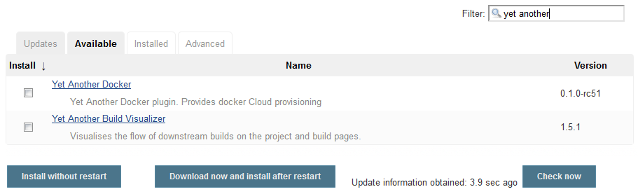
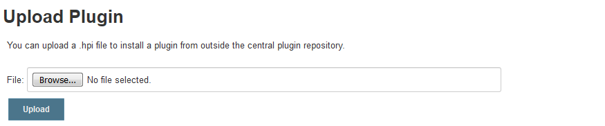

# Plugin Installation

Jenkins provides two common methods for installing or updating plugins on the master:

- Plugin Manager ([Update Center](#jenkins-update-center)) in the web UI
- Built-in command line interface ([CLI](#jenkins-cli))

After successful download of a plugin and its dependencies a Jenkins master restart is only required if the plugin itself or one of the dependencies are updated from a previous installed version. Otherwise the plugin changes take effect directly.

## Jenkins Update Center

Search for plugins under the "Available" tab through the "Manage Jenkins > Manage Plugins" view. Select one or multiple plugins and click "Install without restart" to activate them immediately.



After building a self-contained .hpi file with all necessary code, resources and other dependencies it can be uploaded manually from the web UI through "Advanced" tab.



## Jenkins CLI

The [Jenkins CLI](https://jenkins.io/doc/book/managing/cli/) provides a plugin installation command:

```java
java -jar jenkins-cli.jar -s <JENKINS_URL>:<JENKINS_PORT>/ install-plugin <SOURCE>
```

The *SOURCE* part can be given as a local file reference (.hpi file path), download URL or as the short name of an existing plugin.

## Further Reading

- [Managing Plugins](https://jenkins.io/doc/book/managing/plugins/)
- [Plugins Index](https://plugins.jenkins.io/)
