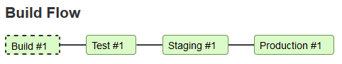
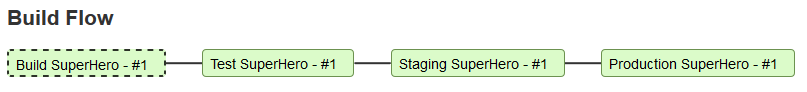

# Practice

## Task

Show the build name instead of the build number in [Yet Another Build Visualizer](https://plugins.jenkins.io/yet-another-build-visualizer) plugin.

You will change the Build Flow view from

to named builds

---
Note: The original change request in [JENKINS-55893](https://issues.jenkins-ci.org/browse/JENKINS-55893) has been already implemented with this [commit](https://github.com/jenkinsci/yet-another-build-visualizer-plugin/commit/e23e04439b14cb3510a741e0e35a239d8c666126) but is used to be reimplemented just for learning purposes of this workshop.
